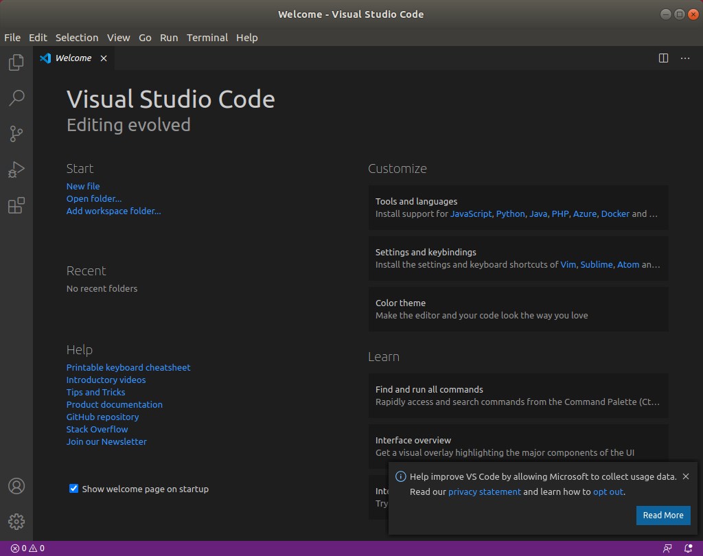
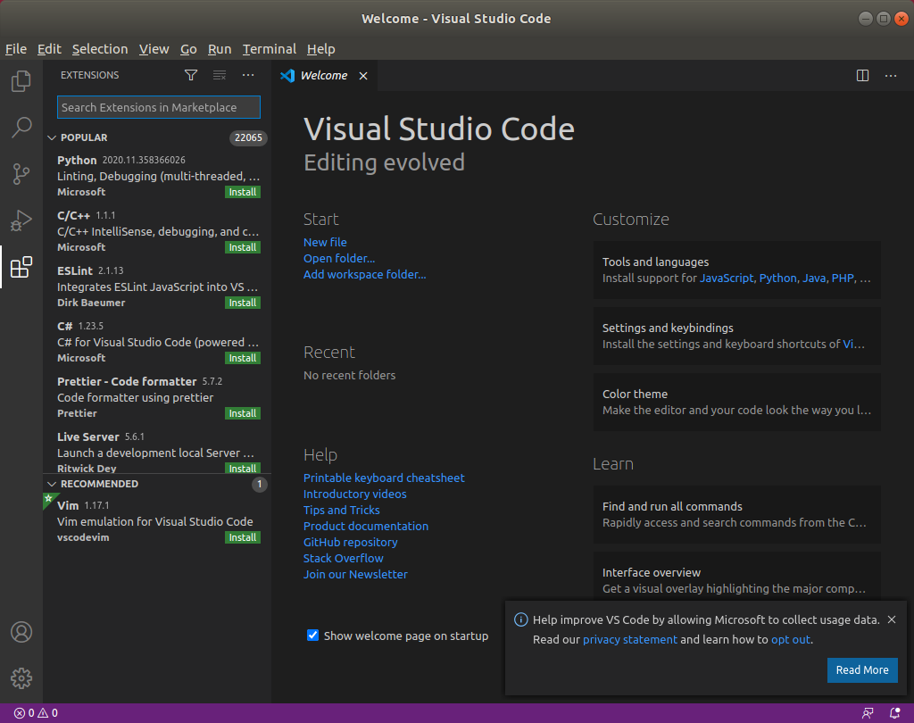
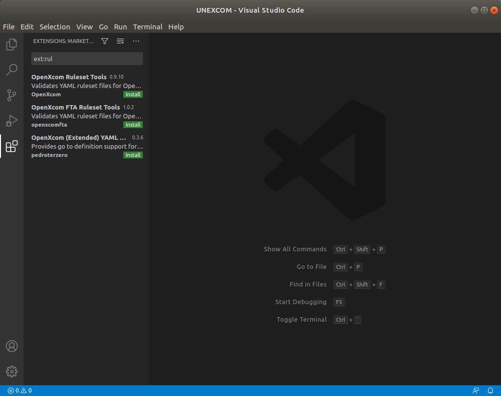
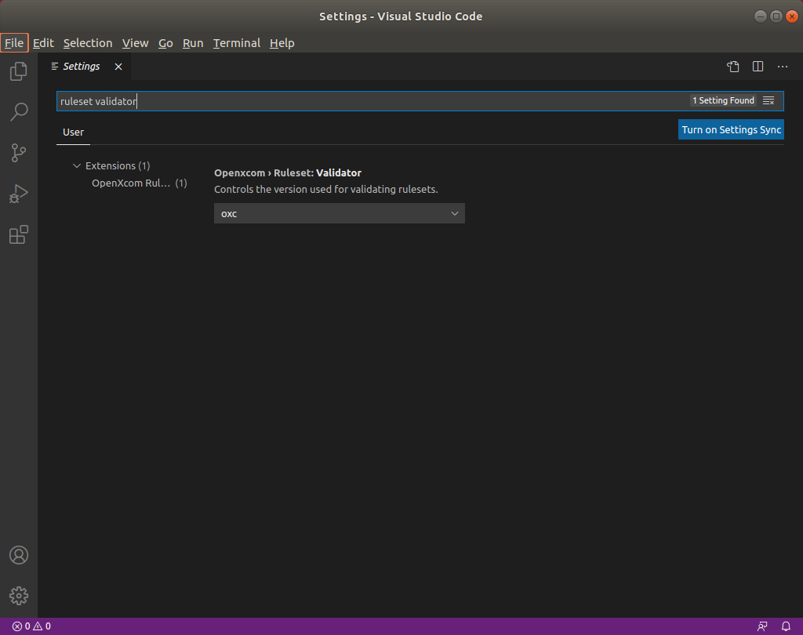
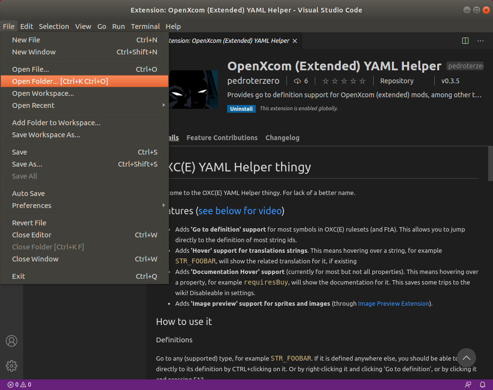
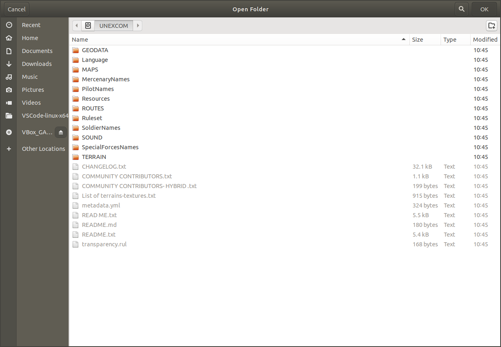
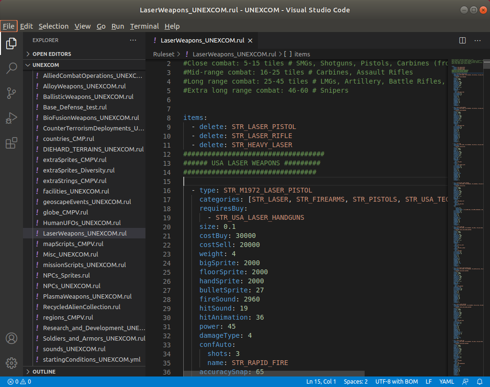

# How to install VSCode and OpenXCOM extensions

## TOC
  - [Install VScode itself](#install-vscode-itself)
  - [Install the extensions](#install-the-extensions)
  - [Optional: Change validation rules from OXC to OXCE](#optional-change-validation-rules-from-oxc-to-oxce)
  - [Open your mod in vscode](#open-your-mod-in-vscode)
  - [Open a rulefile and get modding](#open-a-rulefile-and-get-modding)

## Install VScode itself
* Go to https://code.visualstudio.com/download and download VSCode for your platform
* Install and run it
* It will now look something like this:

  

## Install the extensions
* Open the marketplace (hit CTRL+SHIFT+X or click the button on the left with four squares):

  

* Search the marketplace for `ext:rul` and install both `OpenXCOM Ruleset Tools` and `OpenXCOM Ruleset Linker` by clicking the green install button

  

* Wait for installation to finish

## Optional: Change validation rules from OXC to OXCE
This is needed if you're going to be modding OXCE.

  * Open VSCode's settings by pressing CTRL+, or File => Preferences => Settings
  * Type `ruleset validator`

    
  * Click `oxc` and change it to `oxce`

## Open your mod in vscode
* Now go to `Open Folder`

  
* Navigate to your mod and select it

  

## Open a rulefile and get modding
* Navigate to one of your rule files in the explorer on the left, open it and get modding!

  
